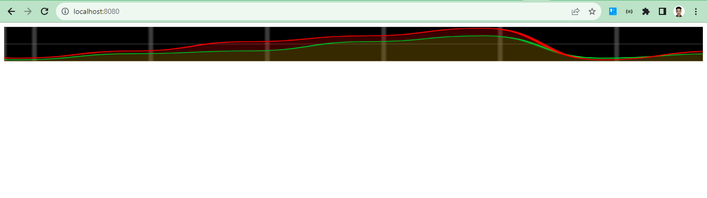

# Spring Cloud Kafka Stream

	
	
Apache Kafka est une plateforme de diffusion d'événements distribuée et open source, conçue pour un traitement à haut débit, une tolérance aux pannes et une mise à l'échelle des flux de données. Elle a été initialement développée par LinkedIn et plus tard mise en open source en tant que projet de la fondation Apache Software.

## Architecture de l'application Spring Kafka Streams Functions et Kafka 

## Accéder à le dossier kafka et tapez cmd

<table>
	<tr>
		<td></td>
		<td></td>
	</tr>
</table>

## Démarrer Zookeeper et Server Kafka à partir CMD
### Zookeeper ###
     start bin\windows\zookeeper-server-start.bat config/zookeeper.properties

### Server Kafka ###
     start bin\windows\kafka-server-start.bat config/server.properties

## Création des Topics kafka et lister la list des topics
### Création
     start bin\windows\kafka-topics.bat --create --bootstrap-server localhost:9092 --topic R1
### La liste des topics crées
     start bin\windows\kafka-topics.bat --bootstrap-server localhost:9092 --list
<table>
	<tr>
		<td></td>
	</tr>
	
</table>
   
## Kafka Console Consumer et Kafka Console Producer
### kafka-console-consumer
     start bin\windows\kafka-console-consumer.bat --bootstrap-server localhost:9092 --topic R1
### kafka-console-producer
     start bin\windows\kafka-console-producer.bat --bootstrap-server localhost:9092 --topic R2

<table>
	<tr>
		<td style="text-align:center"><strong>Kaka Console Consumer</strong></td>
		<td style="text-align:center"><strong>Kaka Console Producer</strong></td>
	</tr>
        <tr>
		<td></td>
		<td></td>
	</tr>
	
</table>

## Test de kafka-console-consumer et kafka-console-producer

## Spring Kafka Stream Functions
<table>
	<tr>
           <td><strong>Consumer</strong></td>
	   <td><strong>Supllier</strong></td>
           <td><strong>RestController</strong></td>	
	   <td><strong>Consumer & Producer (Function)</strong></td>	
	   <td><strong>Kafka Stream (Function)</strong></td>
	   <td><strong>Stream Processing</strong></td>
	</tr>
        <tr>
	    <td></td>
	    <td></td>
	    <td></td>
	    <td></td>
	    <td></td>
	    <td></td>
	</tr>
        
</table>

## Analytics

## application Web Stream Data Analytics en temps réel

